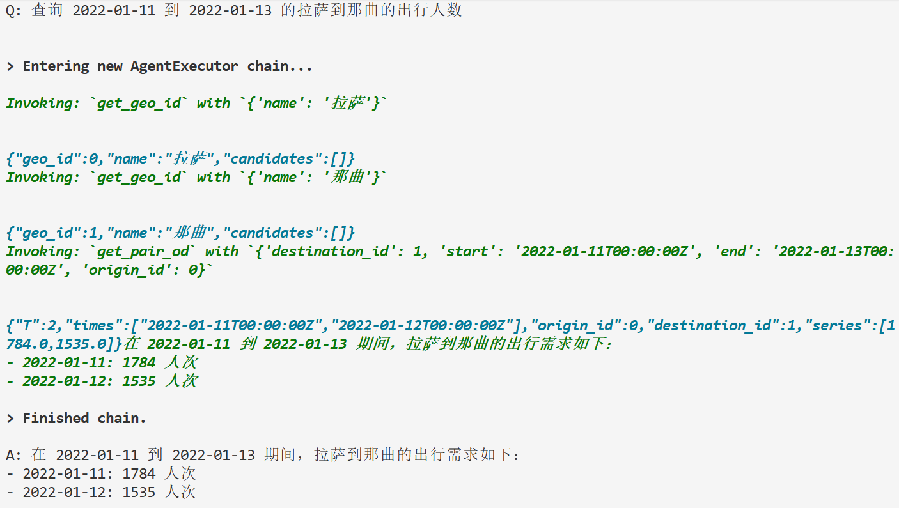

# OD 需求分析与预测agent技术报告

------

## 1. 背景与目标

本系统面向“出行需求（OD）分析与预测”的工程化落地，围绕**数据 → 服务 → Agent**三层架构构建统一能力：

- 将城市节点、空间关系与时序 OD 需求数据标准化存入 SQLite；
- 以 HTTP 服务形式暴露数据读取、统计、预测与评估能力；
- 基于 LangChain（Gemini / OpenAI 均可）实现具备工具调用与推理能力的 Agent，为上层应用（React 前端、工作流）提供自然语言交互入口。

系统强调：**可扩展、可替换（模型/存储/接口）、可追溯**。

------

## 2. 总体架构设计

### 2.1 分层结构

```
┌────────────────────────────────────────────────────────────┐
│                        应用与前端 React                      │
│            自然语言任务：查询、分析、预测、评估、可视化           │
└──────────────▲───────────────────────▲─────────────────────┘
               │自然语言                │HTTP
               │                       │
      ┌────────┴─────────┐     ┌───────┴────────────────────┐
      │  智能体 Agent     │     │         服务端 API          │
      │ LangChain + LLM  │     │      FastAPI + SQLite      │
      │ 工具: geo/OD/预测 │     │ /geo-id /relations /od ... │
      └────────▲─────────┘     └────────▲───────────────────┘
               │工具调用（HTTP）           │SQL 读写
               │                         │
           ┌───┴─────────────────────────┴─——──┐
           │           数据层 SQLite            │
           │     geo / relations / dyna        │
           └───────────────────────────────────┘
```

### 2.2 关键设计取舍

- **轻量存储**：SQLite 足以覆盖多数离线与小规模在线场景；后续可抽象 DAO 层切换到 Postgres/MySQL。
- **服务边界清晰**：数据访问、统计与基线预测统一由 FastAPI 暴露，不在 Agent 内重复实现，Agent 仅作为“工具编排器”。
- **工具化接口**：Agent 的所有能力均通过工具（Tool）实现，工具与 HTTP 接口一一对应，便于权限与治理。
- **容错与兜底**：预测、评估等能力在服务端不可用时，Agent 工具具备轻量 baseline 兜底，保证功能不中断。

------

## 3. 数据层设计

### 3.1 数据模型（逻辑）

- **节点表 `places`**：`(geo_id, type, longitude, latitude, name)`
- **关系表 `relations`**：`(rel_id, type, origin_id, destination_id, cost)`
- **时序表 `dyna`**：`(dyna_id, type, time, origin_id, destination_id, flow, time_epoch?)`

**主外键关系**：`relations.origin_id/destination_id → places.geo_id`；`dyna.origin_id/destination_id → places.geo_id`。

### 3.2 预处理与质量控制

- **导入脚本**
  - `geo_and_relations_to_sqlite.py`：创建 `places`，可同时导入 `relations`。
  - `relations_to_sqlite.py`：向既有 DB 追加/重建 `relations`。
  - `dyna_to_sqlite.py`：导入时序数据，支持 **flow 空值策略**：
    - `null`（默认）：按 `NULL` 存储；
    - `fill`：填指定值（如 `0`）；
    - `skip`：跳过该记录。
- **一致性**
  - 导入前加载 `places.geo_id` 集合做外键校验，不合法记录可**跳过或报错**（`--strict-fk`）。
  - `time` 使用 ISO8601 文本存储，选配 `time_epoch` 加速范围查询。
- **索引建议**
  - `dyna(time)`, `dyna(origin_id)`, `dyna(destination_id)`；`relations(origin_id)`, `relations(destination_id)`。
- **异常策略**
  - CSV 字段缺失/解析失败 → 明确报错行号与字段；
  - 外键缺失 → 可配置为“跳过并告警”或“立即失败”。

------

## 4. 服务端设计（FastAPI）

### 4.1 模块与职责

- **路由层**：输入校验、参数归一、错误处理；
- **DAO 层**：SQLite 查询与数据成型；
- **业务层**：矩阵/张量构造、空值策略、时间轴去重与排序、预测/评估（可在服务端或留给 Agent 兜底）。

### 4.2 核心接口（摘要）

- `GET /geo-id?name=拉萨` → 查 `geo_id`（精确优先，模糊兜底）。
- `GET /relations/matrix?fill=nan|0|...` → 返回 `N×N` 矩阵 + `ids`。
- `GET /od?start=...&end=...&dyna_type=&flow_policy=` → 返回 `[T,N,N]` 张量。
- `GET /od/pair?start=...&end=...&origin_id=&destination_id=&dyna_type=&flow_policy=` → 返回单条 O/D 的**时间序列**（高效）。
- `POST /predict`（可替换为自有模型服务）：输入历史 `[T1,N,N]`，输出未来 `[T2,N,N]`。
- `POST /growth`：增长率 `(b - a)/|a|`（安全模式下 `a=0 → null`）。
- `POST /metrics`：RMSE、MAE、MAPE（忽略 None/NaN，MAPE 对 `y=0` 不计入分母）。

### 4.3 关键处理策略

- **时间范围**：统一采用半开区间 `[start, end)`；
- **空值策略**：
  - 矩阵接口 `fill` 控制未知成本；
  - 时序 `flow_policy` 控制缺失流量（`zero|null|skip`）；
- **性能**：
  - `/od/pair` 优先查 O/D 单列再聚合，避免拉取全量张量；
  - 批量需求时建议引入 `/od/pairs`（后续扩展点）。

------

## 5. Agent 端设计（LangChain + LLM）

### 5.1 Agent 类型与 Prompt 规范

- **类型**：`create_tool_calling_agent`（函数调用风格）或 ReAct。
- **系统提示**聚焦四点：
  1. 只能经工具访问数据；
  2. 优先 `get_pair_od` 获取单条 O/D 序列；
  3. 预测先构造 history 再 `predict_od`；
  4. 评估用 `metrics`，对比用 `growth_rate`。
- **输入输出**倾向结构化：给出关键数值（均值/峰值/增长率/误差）+ 简明结论。

### 5.2 工具与服务映射

| Agent 工具             | 服务接口                | 说明                                               |
| ---------------------- | ----------------------- | -------------------------------------------------- |
| `get_geo_id`           | `GET /geo-id`           | 兼容中文/模糊匹配                                  |
| `get_relations_matrix` | `GET /relations/matrix` | 缺失填充值可配                                     |
| `get_od_demand`        | `GET /od`               | `[T,N,N]`；默认缺失按 0                            |
| `get_pair_od`          | `GET /od/pair`          | 单 O/D 时间序列；接口缺失时回退 `/od` + 客户端筛选 |
| `predict_od`           | `POST /predict`         | 服务端不可用时：naive/moving_average 兜底          |
| `growth_rate`          | `POST /growth`          | 服务端失败本地兜底                                 |
| `metrics`              | `POST /metrics`         | 服务端失败本地兜底                                 |

**容错策略**：HTTP 超时/404 → 工具返回包含 `error` 字段；Agent 侧提示用户并调整方案（例如转为统计已有数据而非预测）。

### 5.3 典型任务编排（时序）

**示例：查询某时间段内拉萨→那曲出行人数并给出增长率**

服务端查询出行人数展示：



```
User → Agent
Agent Thought：需要 geo_id → get_geo_id("拉萨"), get_geo_id("那曲")
Agent Action：get_pair_od({start,end,origin_id,destination_id,dyna_type:"state"})
Agent Thought：计算首末增长率 → growth_rate({a:series[0], b:series[-1]})
Agent Final Answer：返回 times + series 概览、增长率与解释
```

**示例：预测未来 3 步并评估**

```
Agent：get_od_demand({start_hist, end_hist})
Agent：predict_od({history, horizon:3, method:"moving_average", window:3})
Agent：metrics({y_true:last_3_truth, y_pred:pred_tensor})
Agent：输出 RMSE/MAE/MAPE 与关键结论
```

------

## 6. 功能设计

### 6.1 数据读取与装配

- **矩阵装配**：基于 `ids`（有序 geo_id 列表）构建稠密 `[N,N]`，未知值按策略置 `null/0/常数`；
- **张量装配**：以去重后的 `times` 排序为第一维 `[T,N,N]`；
- **O/D 序列**：`/od/pair` 直接返回 `[T]` 序列；缺失值按策略处理（`zero|null|skip`）。

### 6.2 预测能力（可替换）

- **Baseline**（内置，服务端或客户端兜底）：
  - *naive*：复制最后一个时间片 `T2` 次；
  - *moving_average*：最近 `window` 片均值复制 `T2` 次。
- **替换点**：将 `/predict` 接入训练的模型（Torch/TF/ONNX/外部服务）；Agent 侧无需改动。

### 6.3 指标与对比

- **增长率**：`(b - a)/|a|`；`a=0` 安全模式返回 `null`。
- **误差指标**：
  - `RMSE = sqrt(Σ(ŷ−y)² / n)`
  - `MAE = Σ|ŷ−y| / n`
  - `MAPE = Σ|ŷ−y|/|y| / n₊`（只统计 `y≠0` 的对数 `n₊`）
  - 忽略 `None/NaN`，形状可为标量/1D/2D/3D。

------

## 7. 配置与可运维性

- **环境变量**
  - 服务端：`DB_PATH, TABLE_* , PORT`；
  - Agent：`BASE_URL, GOOGLE_API_KEY/OPENAI_API_KEY, 代理`。
- **会话记忆**
  - Agent 使用 `RunnableWithMessageHistory` 基于内存存储对话上下文；可替换为 Redis/数据库持久化。
- **日志**
  - Agent CLI 将每轮问答落盘，便于复盘与验收。
- **CORS/安全**
  - 前后端分离场景在 FastAPI 加 CORS；

------

## 8. 性能与扩展

- **热点查询**：
  - 单 O/D 序列走 `/od/pair`；
  - 批量需求建议增加 `/od/pairs`（一次拿多条 O/D），减少往返。
- **缓存**：
  - 依据 `(start,end,dyna_type,policy,origin,destination)` 作为 key 层叠缓存；
- **并行**：
  - Agent 工具请求可通过工作流编排并发执行（如批量 O/D 同时计算增长率）。
- **存储升级**：
  - 若数据量增大或并发提升，可将 DAO 抽象迁移到 Postgres/MySQL + 连接池；
  - `time` 字段可存 `INTEGER epoch` 并建立组合索引 `(time, origin_id, destination_id)`。

------

## 9. 异常处理与边界

- **时间格式非法**：直接 400，返回明确错误信息；
- **外键缺失**：导入时可“跳过/报错”；查询阶段遇到孤儿记录需忽略；
- **缺失值**：统一通过策略控制，避免隐式插值；
- **MAPE 的 0 分母**：剔除该对样本；
- **Agent 工具失败**：返回带 `error` 字段的 JSON，Agent 在输出中友好提示并给出替代方案（如仅统计历史）。

